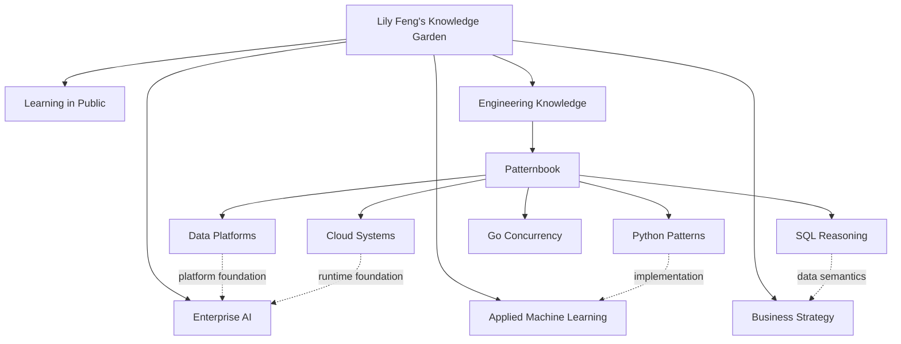

# Patternbook Knowledge Graph Plan

Status: **Draft for review**

This document proposes how Lily Feng's high-level knowledge garden and the detailed Patternbook atlas should fit together. It deliberately separates the stable graph structure from the slower work of writing every detailed guide.

## 1. Two-level architecture

### Main site responsibility

The main `Lily-Feng.github.io` graph should answer:

- What broad areas does Lily work and think in?
- How do enterprise AI, data, engineering, machine learning, and strategy connect?
- Which external atlas or long-form note contains the deeper explanation?

Recommended new high-level domain: **Engineering Knowledge**.

Recommended external node:

| Field | Proposed value |
|---|---|
| Title | Engineering Knowledge Atlas |
| Summary | Connected mental models for cloud systems, data platforms, Python, SQL, and Go concurrency. |
| Kind | External knowledge atlas |
| URL | `https://lily-feng.github.io/Efficient_Learning/` |
| Bridges | Enterprise AI Platform Map, MLOps Lifecycle, Text-to-SQL Chat |

### Patternbook responsibility

Patternbook should answer:

- What are the essential concepts inside an engineering domain?
- Which concepts depend on or reinforce each other?
- Which mental model helps make a real architecture or coding decision?
- Which detailed guide makes the concept concrete?

It should not track completion, streaks, mastery scores, or review status.

## 2. Node and edge vocabulary

### Node types

| Node | Purpose | Example |
|---|---|---|
| Domain | A durable body of engineering knowledge | Cloud Systems |
| Cluster | A coherent group of concepts | Identity & Security |
| Concept | One reusable mental model or decision tool | Least Privilege |
| Guide | A detailed applied explanation | Reason About Least Privilege |
| External note | A bridge back to the main knowledge garden | Enterprise AI Platform Map |

### Edge types

| Edge | Meaning | Example |
|---|---|---|
| contains | Structural parent/child relationship | Cloud contains Networking |
| prerequisite | Understand A before B | Grain before window analytics |
| applies-to | A concept is used in an applied guide | Idempotency applies to reliable messaging |
| contrasts-with | A decision requires comparing alternatives | Batch contrasts with streaming |
| bridges-to | Connects two domains | SQL semantics bridges to data platforms |

The first implementation renders `contains` and `applies-to`. The other edge types should be added selectively after the taxonomy is approved; adding every plausible edge would make the graph noisy.

## 3. Proposed graph by domain

### Cloud Systems

**Thesis:** Design from workload requirements and failure domains; translate the pattern to each provider only after the architecture is clear.

1. Cloud foundations
   - Shared responsibility
   - Regions and zones
   - Resource hierarchy
2. Compute and placement
   - Stateless scaling
   - VM → container → function
   - Workload placement
3. Networking
   - Network boundaries
   - Private connectivity
   - DNS and global routing
4. Data and messaging
   - Storage selection
   - Consistency and replication
   - Reliable messaging
5. Identity and security
   - Least privilege
   - Secrets and encryption
   - Policy guardrails
6. Reliability and operations
   - SLOs and error budgets
   - Regional failure
   - Observability and FinOps

Provider names belong in concept translations, not as top-level branches. For example, reliable messaging maps to SQS/SNS, Service Bus, and Pub/Sub inside one concept.

### Data Platforms

**Thesis:** Build a governed path from source change to trusted consumption, then select platform products by workload and operating model.

1. Platform architecture
   - Lakehouse vs warehouse
   - Data layers
   - Platform selection
2. Ingestion and change
   - Batch, CDC, and streaming
   - Incremental processing
   - Schema contracts
3. Storage and layout
   - Files and table formats
   - Partitioning and clustering
   - Retention and recovery
4. Processing and quality
   - Transformation model
   - Orchestration
   - Quality and lineage
5. Serving and semantics
   - Semantic layer
   - Data products and sharing
   - AI and feature serving
6. Governance and performance
   - Catalog and access
   - Query diagnosis
   - Workload and cost

Databricks, Snowflake, and Fabric should appear as platform translations and decision evidence across these clusters—not as separate silos.

### Python Patterns

**Thesis:** Recognize the structural signal in a problem, state the invariant, then choose the smallest data structure that maintains it.

1. Reasoning foundations
   - Time and space complexity
   - Python semantics
   - Constraints and edge cases
2. Sequences
   - Two pointers
   - Sliding window
   - Prefix sums
3. Lookup and ordering
   - Hash maps and sets
   - Heaps and Top K
   - Binary search
4. Core structures
   - Stacks and queues
   - Linked lists
   - Trees and BSTs
5. Graphs
   - BFS and DFS
   - Union–find
   - Topological sort
6. Search and optimization
   - Backtracking
   - Greedy
   - Dynamic programming

Every detailed guide should explain the recognition signal, invariant, template, complexity, and failure modes—not merely provide a solved LeetCode answer.

### SQL Reasoning

**Thesis:** Reason from row grain and relational transformations; use SQL syntax only to express the proven sequence.

1. Execution model
   - Logical query order
   - NULL and three-valued logic
   - Grain and cardinality
2. Relational operations
   - Join semantics
   - Existence and anti-joins
   - Set operations
3. Aggregation
   - GROUP BY and HAVING
   - Conditional aggregation
   - Top N per group
4. Window analytics
   - Ranking
   - Window frames
   - LAG, LEAD, and sessions
5. Data quality patterns
   - Deduplicate latest
   - Slowly changing dimensions
   - Gaps and islands
6. Modeling and performance
   - Keys and dimensional models
   - Pruning and indexes
   - Explain plans

The grain of a dataset should be treated as the prerequisite node for joins, aggregation, window functions, and dimensional models.

### Go Concurrency

**Thesis:** Treat every goroutine as an owned resource with bounded work, explicit communication, and a defined exit path.

1. Runtime model
   - Goroutines and scheduler
   - Memory model
   - Data races
2. Channels
   - Ownership and closure
   - Buffers and backpressure
   - Select, fan-out, and fan-in
3. Synchronization
   - Mutexes and atomics
   - WaitGroup
   - Errgroup
4. Lifecycle and cancellation
   - Context cancellation
   - Timeouts and cleanup
   - Goroutine leaks
5. Concurrency patterns
   - Worker pools
   - Pipelines
   - Rate limiting
6. Production operations
   - Profiling and tracing
   - Graceful shutdown
   - Distributed boundaries

The central graph invariant is: every goroutine must have an owner, a bounded responsibility, and an exit condition.

## 4. Cross-domain bridges

These edges should connect Patternbook domains without collapsing them into one graph:

| From | To | Shared idea |
|---|---|---|
| Cloud reliable messaging | Go worker pools | Backpressure and bounded concurrency |
| Cloud regional failure | Data retention and recovery | RTO, RPO, replication, and replay |
| Data incremental processing | SQL deduplication | Idempotency and deterministic ordering |
| Data semantic layer | SQL grain and cardinality | Trusted metric definitions |
| Python graph traversal | Data orchestration | DAGs and dependency ordering |
| Go distributed boundaries | Cloud reliability | Timeouts, retries, and idempotency |

## 5. Content expansion sequence

After the graph is approved, expand guides in this order:

1. Write the foundation nodes that many other concepts depend on:
   - Cloud failure domains
   - Data grain and contracts
   - Python complexity and invariants
   - SQL grain and logical query order
   - Go ownership and lifecycle
2. Add the highest-frequency applied patterns.
3. Add explicit prerequisite and cross-domain edges.
4. Add external links from the main knowledge garden.
5. Review graph density and remove edges that do not improve navigation.

## 6. Decisions requested from Lily

Please review these five choices before the main site is changed:

1. **High-level name:** use `Engineering Knowledge`, `Technical Foundations`, or another label?
2. **Scope:** should distributed systems be a future sixth Patternbook domain, or remain a bridge across Cloud and Go?
3. **Data platform boundary:** should Spark fundamentals live inside Data Platforms or become a separate processing cluster?
4. **Python boundary:** should Python remain interview-pattern focused, or also include production Python engineering?
5. **Graph depth:** is six clusters × three concepts per domain the right first level, or should the visible graph be smaller?

No changes to the main `Lily-Feng.github.io` graph should be published until these choices are approved.
